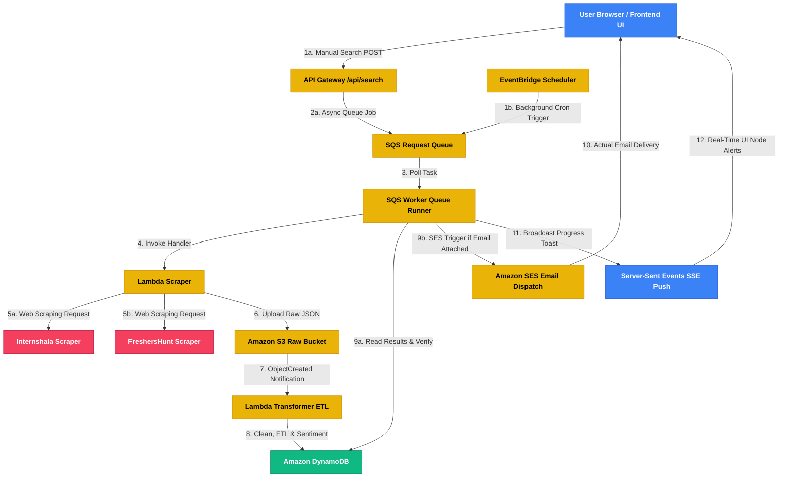

# AWS Web Scraping & Analytics Pipeline

A serverless AWS-native architecture that automates web scraping based on user queries, processes the raw data, performs AI insights mining, and visualizes results on a premium frontend search dashboard.

---

## Architecture Flow



1. **Frontend Dashboard**: A premium, glassmorphic UI featuring real-time event tracking, interactive Chart.js visualizations, and custom visibility-fixed select selectors.
2. **API Gateway / Scheduler**: Handles manual web search queries or triggers cron schedules (EventBridge Scheduler) on demo rates or standard weekly/daily updates.
3. **SQS Request Queue**: Receives asynchronous JSON requests (`202 Accepted` returned immediately) to isolate scraper execution from web thread timeouts.
4. **SQS Worker Queue Runner**: A background thread polling the queue and processing scraper tasks sequentially.
5. **Lambda Scraper (BeautifulSoup)**: Queries Internshala and FreshersHunt.in, extracts metadata (titles, company name, location, relative ages, post links), and compiles the raw payload.
6. **Amazon S3 Raw Bucket**: Receives and stores raw scraped JSON documents.
7. **Lambda Transformer (ETL)**: Triggered by S3 events. Cleans currency symbols, calculates relative posting dates, performs Comprehend-simulated text keyword and sentiment processing, and writes clean records to DynamoDB.
8. **Amazon DynamoDB**: Stores cached search records and metric summary entries, maintaining zero data duplication via query-specific cache overwrites.
9. **Amazon SES Email Dispatch**: Triggered on EventBridge task completion. Sends real summary emails using verified email identities in `ap-south-1`.
10. **Server-Sent Events (SSE)**: Streams real-time progress logs and notifications from the enqueued pipeline back to the UI.


---

## Local AWS Simulator (No-Dependency Demo)

To run the entire pipeline locally without AWS credentials or dependencies:

1. Open a terminal and run the simulator script:
   ```bash
   python run_demo.py
   ```
2. Open your browser and navigate to:
   ```
   http://localhost:5000/index.html
   ```
3. Type a keyword (e.g., `"mechanical keyboards"`, `"laptops"`, or `"DevOps jobs"`) and hit **Scrape & Analyze**.
4. Observe the console logs detailing the progression through API Gateway -> SQS -> Scraper -> S3 -> Transformer -> DynamoDB, followed by instant charts, cards, and structured tables.

*Note: The local simulator contains a dependency shield that auto-mocks `boto3`, `requests`, and `bs4` if you do not have them installed, meaning it runs completely zero-dependency on any clean Python environment!*

---

## AWS Deployment Instructions (SAM)

### Prerequisites
- AWS CLI installed and configured (`aws configure`).
- AWS SAM CLI installed.
- Python 3.9+ installed.

### Steps to Deploy
1. **Navigate to the infra directory**:
   ```bash
   cd backend/infra
   ```

2. **Build the SAM application**:
   ```bash
   sam build
   ```

3. **Deploy to your AWS Account**:
   ```bash
   sam deploy --guided
   ```
   Provide the configuration parameters (Stack name, region, confirm changesets).

4. **Update Frontend API Endpoint**:
   - Once deployment completes, SAM will output the `SearchApiUrl` in the terminal outputs.
   - Open `frontend/app.js` and update the URL in line 84:
     ```javascript
     const eventSource = new EventSource(`YOUR_API_GATEWAY_URL/search?query=${escQuery}`);
     ```
